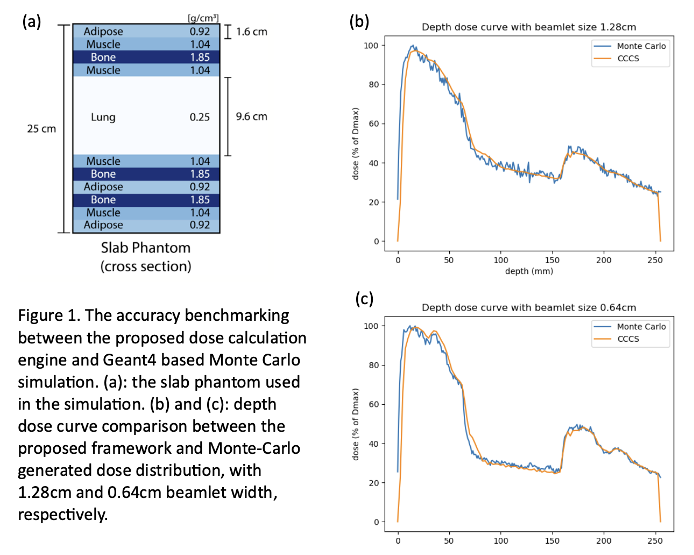

# Fast dose calculation & optimization
This software framework provides an efficient solution for dose calculation and treatment plan optimization in external-beam radiation therapy, addressing the growing need for faster and more adaptable treatment planning methods. Particularly suited for complex cases involving non-coplanar, non-isocentric beam configurations, it offers unprecedented speed and versatility.
## Introduction
The emergence of non-coplanar, non-isocentric, and multimodal treatment planning poses significant challenges to current dose calculation and optimization methods due to increased complexity. Previous attempts \[[1](https://doi.org/10.1118/1.3551996), [2](https://doi.org/10.1118/1.4895822)\] have focused on accelerating the dose calculation process. However, with advancements in modern GPU performance and library support, there is ample opportunity to enhance existing algorithms. In this work, we present an integrated framework utilizing GPU technology, seamlessly coupling dose calculation and treatment plan optimization to achieve unparalleled speed-ups.

The framework comprises three main components:
* Preprocessing: This stage involves processing DICOM image files and structure annotations to produce a resampled isotropic phantom and anatomy masks.
* Dose calculation: Here, the user specifies a list of beams, each of which is discretized into beamlets (pixels) according to a user-defined resolution. Only beamlets intersecting with the planning target volume (PTV) are active. The framework calculates the beamlet-wise dose distribution within the phantom and returns it as a sparse matrix aligned with the phantom's geometry.

    Dose calculation employs the Collapsed-Cone Convolution/Superposition (CCCS) method \[[3](http://dx.doi.org/10.1118/1.596360)\] with an exponential kernel. The dose for all active beamlets within a single beam is collectively computed on a grid aligned with the beamlet's eye view (BEV). This grid is translated to the phantom's geometry using interpolation with CUDA's native texture memory functionality. The interpolated dose is then converted into a sparse matrix using the cuSPARSE library.

* Optimization: This step aims to select an optimal set of beams from a list of candidate beams specified by the user. The fluence maps of the selected beams are then optimized to yield the final dose distribution. The loss function for beam selection consists of three terms:
    $$
    \begin{align*}
    & L = L_1 + L_2 + L_3, \\
    & L_1 = \frac{\mu}{2} \|\left(A_0x-d_{\text{min}}\right)_-\|_2^2 + \sum_{i=0}^{N_{\text{OAR}}} \|\left(A_ix - d_{\text{max}}^{(i)}\right)_+\|_2^2 + \sum_{i=1}^{N_{\text{OAR}}} \|A_i x\|_2^2, \\
    & L_2 = \frac{1}{2\gamma} \left\|\text{prox}_{\gamma\|\cdot\|_1}(Dx) - Dx\right\|_2^2, \\
    & L_3 = \sum_{i=1}^{N_{\text{beam}}}w_b\|x_b\|_2^\frac{1}{2}.
    \end{align*}
    $$
    In the equations above
    * $x = [x_1^T, x_2^T, ... x_{N_{\text{beam}}}^T]^T$ is the weights of the active beamlets in all beams.
    * $A = [A_0^T, A_1^T, A_2^T, ... A_{N_{\text{OAR}}}^T]^T$ is the dose loading matrix.
    * $d_\text{min}$, $d_{\text{max}}$ are the minimum and maximum doses requirements.
    * $\|a\|_m^n = \left( \sum_{i=1}^N a_i^m \right)^{n/m}$.
    * $\text{prox}_{f}(x) = \argmin_{u\in \text{dom}f} f(u) + \frac12 \|u-x\|_2^2$.

    $L_1$ enforces the resulting dose to conform to the target distribution, ensuring the PTV dose exceeds the minimum value, the overall dose stays below the maximum value, and penalizing the dose to organs at risk (OARs).

    $L_2$ promotes fluence map smoothness to ensure field deliverability.

    $L_3$ encourages beam sparsity, aiming to select as few beams as possible.

## Installation
This work is developed on Ubuntu 20.04.4, utilizing an AMD EPYC 7542 32-core processor and 4 NVIDIA RTX A6000 GPUs. The following dependencies are required:
* CMake (tested on version 3.16.3)
* gcc (tested on version 9.4.0)
* nvcc (tested on version 12.2)
* Boost
* HDF5
* Eigen3
* OpenMP
* DCMTK
* Geant4 (optional)

The Geant4 library is used to generate exponential kernel parameters for CCCS and for dose accuracy verification. Users can utilize the provided spectrum `/data/FastDose/scripts/spec_6mv.spec` and kernel `/data/FastDose/scripts/kernel_exp_6mv.txt`. To disable Geant4 modules, please comment the lines `add_subdirectory(boxScore)` and `add_subdirectory(kernelGen)` in `/data/FastDose/CMakeLists.txt`. To install:
```
~$ cd /data/FastDose
/data/FastDose$ mkdir build
/data/FastDose$ cd build
/data/FastDose/build$ cmake ..
/data/FastDose/build$ make
```

## Running instructions
An example case is provided [here](https://zenodo.org/records/10810993). Before running, please modify the parameters in the bash scripts accordingly. For a detailed explanation of parameters, use the following commands:
```
/data/FastDose$ ./build/bin/preprocess --help
/data/FastDose$ ./build/bin/IMRT --help
```
* Preprocessing
    ```
    /data/FastDose$ bash ./scripts/PreProcess.sh
    ```
    It generates the isotropic density volume, associated anatomy mask, and metadata in the folder specified in the argument `inputFolder`.
* Dose calculation

    Specify the argument `mode` as 0
    ```
    /data/FastDose$ bash ./scripts/imrtOpt.sh
    ```
    Here we explain the parameters `subFluenceDim` and `subFluenceDimOn`. In the dose calculation, each beamlet is further discretized, rather than using a single pixel to represent the beamlet. Assume we have `subFluenceDim` = 16, `subFluenceDimOn` = 4, and `beamletSize` = 0.5. Then the beamlet can be viewed as a 16-by-16 square of with resolution 0.125cm, and its central 4-by-4 square is on.

    It generates the data of the dose matrix, and stored in the subdirectory `doseMatFolder` of the folder specified in the argument `outputFolder`. The dose matrix is stored in compressed sparse row (CSR) format.
* Optimization
    
    Specify the argument `mode` to as 1
    ```
    /data/FastDose$ bash ./scripts/imrtOpt.sh
    ```
    It reads the dose generated, select the optimal beams, and polish the fluence map according to the parameters specified in the files specified by arguments `StructureInfo` and `params`. In `params` file, the entry `ChangeWeightsTrigger` is the number of iterations between increasing the `beamWeight` to ensure that `beamWeight` is big enough to penalize excessive beams. `pruneTrigger` is a list of iteration numbers at which to exclude the inactive beams from the dose loading matrix for computation efficiency.

Please be aware that all matrices, including the density, optimized fluence map, and dose distribution, are stored in column-major order. Please take into consideration the layout disparities between different programming languages, such as MATLAB and Python.

## Validation
Dose calculation accuracy is benchmarked against Geant4-based Monte Carlo simulation on a slab phantom, achieving passing rates of 91.26% and 95.15% at beamlet widths of 0.64cm and 1.28cm, respectively, under a gamma passing criterion of 3%/3mm. Refer to the figure below for plots.


## Extension
Within the `scripts` folder, two scripts, namely `doseDataInit.m` and `readDose.m`, are provided to facilitate users in reading the dose loading matrix and anatomy segmentation masks.